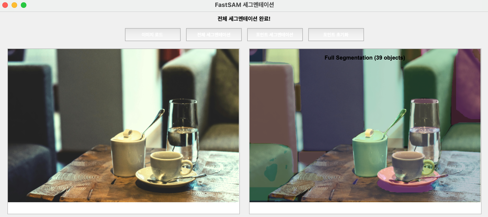
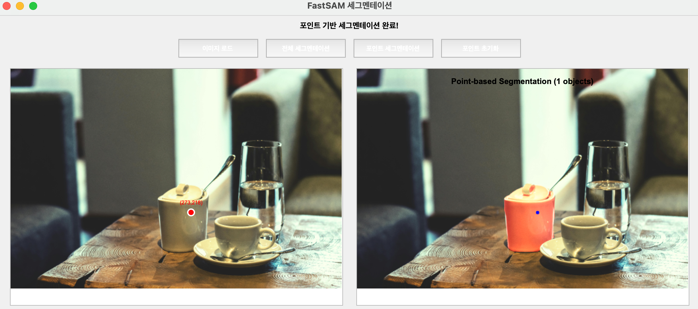

# Vision-AI-Tutorials

💡 **Computer Vision**과 **AI**를 쉽게 배우고 실습할 수 있는 예제 모음입니다. 
각 예제는 최신 모델과 기술을 활용하여 실제 문제를 해결하는 방법을 제공합니다 🙌

## 📌 Image Classification
- [**SwinT** 이미지 분류 모델 학습](Image_Classification/SwinT_image_classification.ipynb)
  - Huggingface 기반 SwinT 모델 학습 및 평가
  - 계층적 특징 추출과 이동 윈도우 메커니즘 활용하여 ViT 대비 높은 정확도와 효율적인 계산 비용으로 대규모 이미지 분류에 적합

- [**SwinT** PyTorch 기반 학습](Image_Classification/SwinT_image_classification_with_pytorch.ipynb)
  - PyTorch 프레임워크를 활용한 SwinT 모델 학습
  - Huggingface 없이 순수 PyTorch로 구현하여 모델 구조와 학습 과정을 더 깊이 이해

- [**CLIP** Zero-shot 분류](Image_Classification/CLIP_Zero_shot_Classification.ipynb)
  - 사전 학습된 CLIP 모델을 활용한 Zero-shot 이미지 분류
  - 텍스트-이미지 쌍 학습을 통해 새로운 클래스에 대한 분류 가능
  - 별도의 학습 없이 텍스트 프롬프트만으로 이미지 분류 수행
  
## 📌 Object Detection
- [**YOLOv5** 커스텀 데이터셋 학습](Object_Detection/YOLOv5_training_custom_dataset.ipynb)
  - YOLOv5 기반 커스텀 데이터셋 학습 및 추론
  - 실시간 객체 검출이 가능한 경량화된 모델

- [**OWLv2** Zero-Shot 객체 검출](Object_Detection/OWLv2_Zero_Shot_Object_Detection.ipynb)
  - Google의 OWLv2 모델을 활용한 텍스트 기반 Zero-shot 객체 검출
  - 텍스트 쿼리만으로 새로운 객체 검출 가능

## 📌 Segmentation
- [**SAM** 자동 마스크 생성](Segmentation/SAM_Automatic.ipynb)
  - Meta의 Segment Anything Model(SAM) 기반 자동 객체 분할
  - 대규모 데이터셋으로 학습된 범용 세그멘테이션 모델
  - 다양한 도메인의 이미지에서 객체 분할 가능

- [**FastSAM** 인터랙티브 세그멘테이션](Segmentation/FastSAM_interactive_seg.py)
  - FastSAM 기반 실시간 인터랙티브 세그멘테이션 도구
  - SAM 대비 50배 빠른 처리 속도와 10배 작은 모델 크기
  - 전체 이미지 자동 세그멘테이션과 클릭 기반 포인트 세그멘테이션 지원
  - 객체별 차별화된 색상 시각화
  
  **예시 결과**
  - 전체 세그멘테이션: 
  - 포인트 기반 세그멘테이션: 
  
## 📌 Image Generation
- [**Stable Diffusion** 텍스트 기반 이미지 생성](Image_Generation/Stable_Diffusion_v1_4_Text_to_Image_Generation.ipynb)
  - Stable Diffusion v1.4 기반 텍스트-이미지 생성
  - 고품질 이미지 생성과 빠른 추론 속도
  - 다양한 스타일과 콘셉트의 이미지 생성 가능